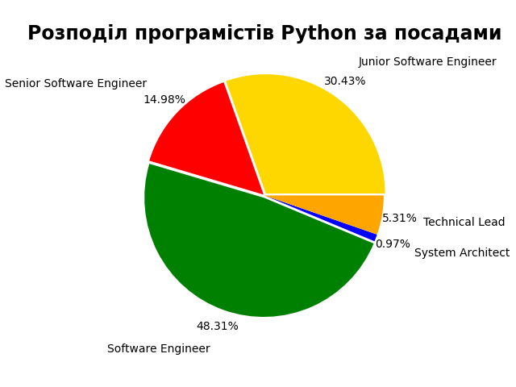
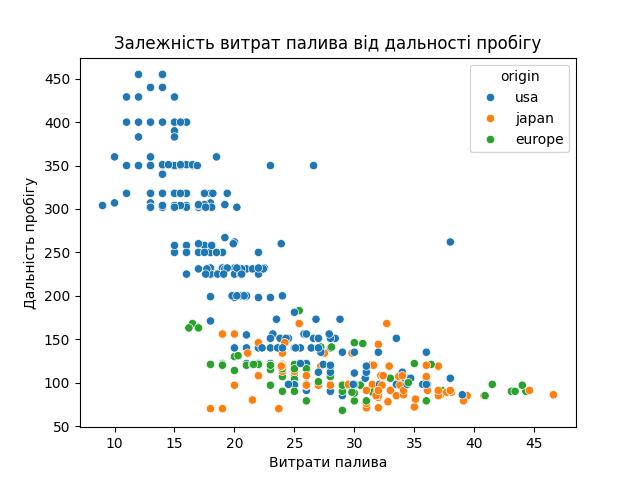

Мій перший лінійний графік реалізований за допомогою бібліотеки  matplotlib

Моя перша діаграма стопвчиком 
  
Моя перша кругова діаграма
  
Графік лінійний №2

Точковий графік залежності дальності пробігу автомобіля від витрат палива 